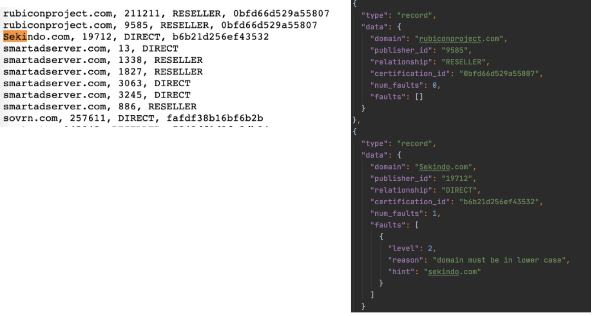

### A simple ads-txt validator (iab 1.0.2)

https://iabtechlab.com/wp-content/uploads/2019/03/IAB-OpenRTB-Ads.txt-Public-Spec-1.0.2.pdf

- [x] validate domains format
- [x] validate relationship
- [x] validate record format
- [x] validate variable type (contact/subdomain)
- [x] follow and merge subdomains ads.txt
- [x] ignore comments

todo:

- [ ] find duplicates
- [ ] keep comments
- [ ] domain name misspelling checking
- [ ] certification id verification